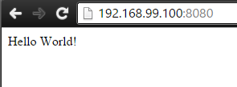

# docker-groovy-sample
A simple Dockerfile + Spring Boot + Groovy "Hello World" sample.

## Build the container image from the Dockerfile
Assuming the `Dockerfile` is in the current directory, build the image as:

    docker build .

## Tag the container
Run `docker images` to list the local container images. Assuming that the ID of the `docker-groovy-sample` container is e.g. `25770faac5e5` the container can be tagged:

    docker tag 25 olatheander/docker-groovy-sample

Listing the containers after the tag using `docker images`:

    $ docker images
    REPOSITORY                         TAG                 IMAGE ID            CREATED             VIRTUAL SIZE
    olatheander/docker-groovy-sample   latest              25770faac5e5        3 hours ago         651.3 MB
    java                               8                   d4849089125b        2 weeks ago         642 MB

## Run container
Run the container as:

    docker run -d -p 8080:8080 olatheander/docker-groovy-sample

Using **Docker Toolbox** the service can be accessed from the host at `http://192.168.99.100:8080/` outputting "Hello World!":

